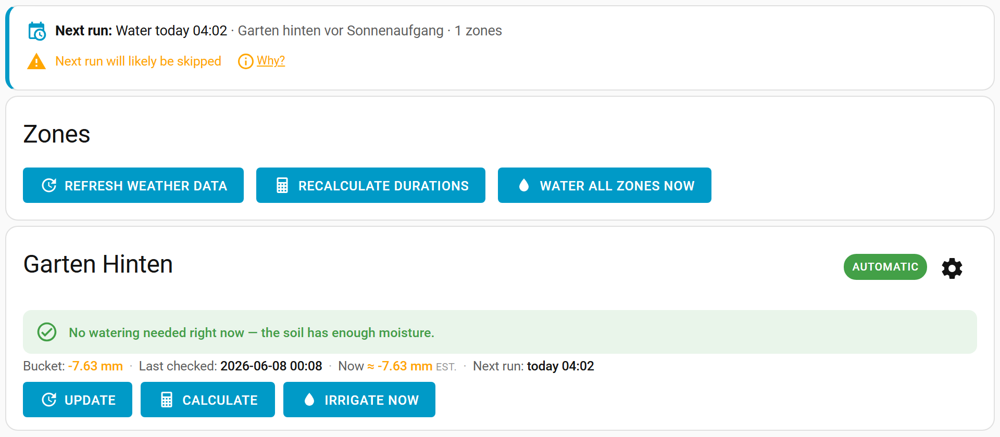

[](https://github.com/hacs/integration)
[![release][release-badge]][release-url]

[release-url]: https://github.com/JustChr/HAsmartirrigation/releases
[release-badge]: https://img.shields.io/github/v/release/JustChr/HAsmartirrigation?style=flat-square

# Smart Irrigation — Maintained Community Fork


This is an actively maintained community fork of [jeroenterheerdt/HAsmartirrigation](https://github.com/jeroenterheerdt/HAsmartirrigation), which has been stale since late 2025. It ships all the original functionality plus a growing set of bug fixes and improvements — see [What's been fixed and improved](#whats-been-fixed-and-improved) below.

## What it does

This integration calculates how long to run your irrigation system to compensate for moisture loss caused by [evapotranspiration](https://en.wikipedia.org/wiki/Evapotranspiration). It takes precipitation (rain, snow) and evaporation into account and tells you exactly how many seconds to irrigate — no more guesswork.



- Water only what evaporated — no over- or under-watering
- Tracks a running moisture balance ("bucket") per zone
- Supports multiple zones, each with its own size, throughput, module, and sensor group
- Works with **Open-Meteo** (free, no API key), Open Weather Map, Pirate Weather, or your own local sensors
- **Guided setup wizard** — a first-run wizard walks you through weather, calculation module, sensor group, and your first zone in a few steps
- **Direct valve control** — link a `switch` or `valve` entity to each zone; the integration turns it on, waits the calculated duration, and turns it off — no automations needed
- **Everyday dashboard** — the **Zones** tab is an at-a-glance [dashboard](https://JustChr.github.io/HAsmartirrigation/usage-dashboard.html) showing, per zone, whether it will water and why, with one-tap Update / Calculate / Irrigate; full configuration lives under **Setup → My Zones**
- **Forward-looking outlook** — a banner shows the next scheduled run and whether it will likely be skipped (tap **“Why?”** for the reasons); per-zone decisions are honest about skip conditions
- **Live status estimate** — a read-only "Now ≈ −X mm" estimate of each zone's deficit *since the last calculation*, using the hourly FAO-56 equation where hourly solar data is available — so the status isn't stale between daily calculations
- **Lovelace card** — a [`custom:smart-irrigation-zones-card`](https://JustChr.github.io/HAsmartirrigation/usage-lovelace-card.html) that mirrors the dashboard for **non-admin** users, addable to any dashboard
- **Irrigate Now** — trigger immediate irrigation from the dashboard (all zones or per zone), bypassing skip conditions
- **Recurring schedules** — create daily/weekly/monthly/interval irrigation schedules entirely from the UI (**Setup → When to Water**) — no automations needed
- **Skip conditions** — skip irrigation based on forecasted rain (with a configurable forecast look-ahead window), low temperature, high wind speed, or a rain sensor
- Enforces a configurable minimum number of days between irrigation events
- Still fires HA events for power users who prefer automation-based control

## What's been fixed and improved

Compared to the last upstream release (`v2025.10.0`):

### Bug fixes
| Issue | Fix |
|---|---|
| Dialog buttons invisible on HA 2026.3+ | Migrated from deprecated `mwc-button` to `ha-button` / `ha-dialog-footer` |
| Sensor group edits silently discarded on save | Frontend no longer echoes server-computed fields back; backend sanitises before storing |
| Noisy WARNING on startup for sensor values | Downgraded to DEBUG |
| Pirate Weather precipitation off by 10× | SI mode returns `precipAccumulation` in cm, not mm — added ×10 conversion |
| API key / weather service change not taking effect after reconfigure | Options flow values now always win over initial setup data on reload |
| Days-between-irrigation fires at ~½ the configured interval | Counter was incremented twice per day (in skip path + at midnight); midnight is now the single source |
| Duplicate sensors after disable / re-enable | Fixed dispatcher listener leak + stopped removing entities from HA registry on unload |
| Bucket fluctuates with every forecast change | Now uses actual measured precipitation (`rain.1h`) instead of the daily forecast total |

### Improvements
- **Redesigned UI** — a guided first-run setup wizard, a slim everyday **Zones** dashboard (per-zone "will it water, and why" plus one-tap Update / Calculate / Irrigate), and all zone configuration / reporting consolidated under **Setup → My Zones**. Destructive actions now confirm, settings auto-save with a "Saved" indicator, and the General settings page is grouped into labelled sections.
- **Direct valve control** — link a switch/valve entity per zone; the integration controls it directly with no automation needed
- **Zone sequencing** — choose parallel (all zones at once) or sequential (one at a time) in General Settings
- **Recurring schedules** — full create/edit/delete UI for irrigation schedules inside the panel
- **Irrigate Now buttons** — on the Zones dashboard (all zones or per zone), bypasses skip conditions
- **Skip conditions** — temperature threshold, wind speed threshold, and rain sensor entity added alongside the existing precipitation forecast check
- **Fully localized** — the panel ships translations for 7 languages besides English

> **Note:** the old **Seasonal Adjustments** tab was removed in favor of the more flexible Schedules system. If you relied on it, recreate the behavior with per-zone multipliers and recurring schedules.
- **Open-Meteo weather service** — free, no API key required
- **Mobile-friendly number inputs** — Zone float fields use `step=0.1` + `inputmode=decimal`; integer fields use `step=1` + `inputmode=numeric`; values parsed with `valueAsNumber` to avoid browser format differences
- **Extended sensor attributes** — `multiplier`, `lead_time`, `maximum_duration`, `maximum_bucket` now exposed as entity attributes for use in automations and templates
- **Code hygiene** — removed ~280 lines of dead commented-out V1 code, duplicate constant definitions, and orphaned test files

## Installation

This integration is not in the default HACS store. Install it as a **custom repository**:

1. In Home Assistant, open **HACS → Integrations → ⋮ → Custom repositories**
2. Add `https://github.com/JustChr/HAsmartirrigation` with category **Integration**
3. Search for "Smart Irrigation" and install
4. Restart Home Assistant
5. Go to **Settings → Devices & Services → Add Integration**, search for "Smart Irrigation" and follow the wizard

### Manual installation

Download the [latest release](https://github.com/JustChr/HAsmartirrigation/releases/latest) as a zip, extract the `custom_components/smart_irrigation` folder into your Home Assistant `custom_components` directory, then restart.

## Documentation

Full documentation: **https://JustChr.github.io/HAsmartirrigation/**

The docs site is built from the [`docs/`](docs/) folder with Jekyll and deployed automatically by the [Pages workflow](.github/workflows/jekyll-gh-pages.yml) on every change under `docs/`.

## Reporting issues

Open an issue at https://github.com/JustChr/HAsmartirrigation/issues

## Development

### Quick start

```bash
git clone https://github.com/JustChr/HAsmartirrigation.git
cd HAsmartirrigation
make setup          # creates .venv and installs dependencies
```

### Useful commands

```bash
make test           # run the test suite
make lint           # ruff + prettier
make format         # auto-format Python and TypeScript
```

### Frontend

The frontend is a TypeScript / Lit bundle. After editing files in `custom_components/smart_irrigation/frontend/src/`:

```bash
cd custom_components/smart_irrigation/frontend
npm run build
# On Windows, the babel step fails — run separately:
npx babel dist/smart-irrigation.js --out-file dist/smart-irrigation.js
```

The compiled `dist/smart-irrigation.js` is committed to the repo (gitignored but tracked) so users don't need Node.js to run the integration.

### Tests

```bash
pytest tests/        # or: make test
```

See [CONTRIBUTING.md](CONTRIBUTING.md) for more detail.

## Credits

Original integration by [@jeroenterheerdt](https://github.com/jeroenterheerdt). This fork picks up active maintenance and applies community-contributed fixes from the upstream pull request queue.
