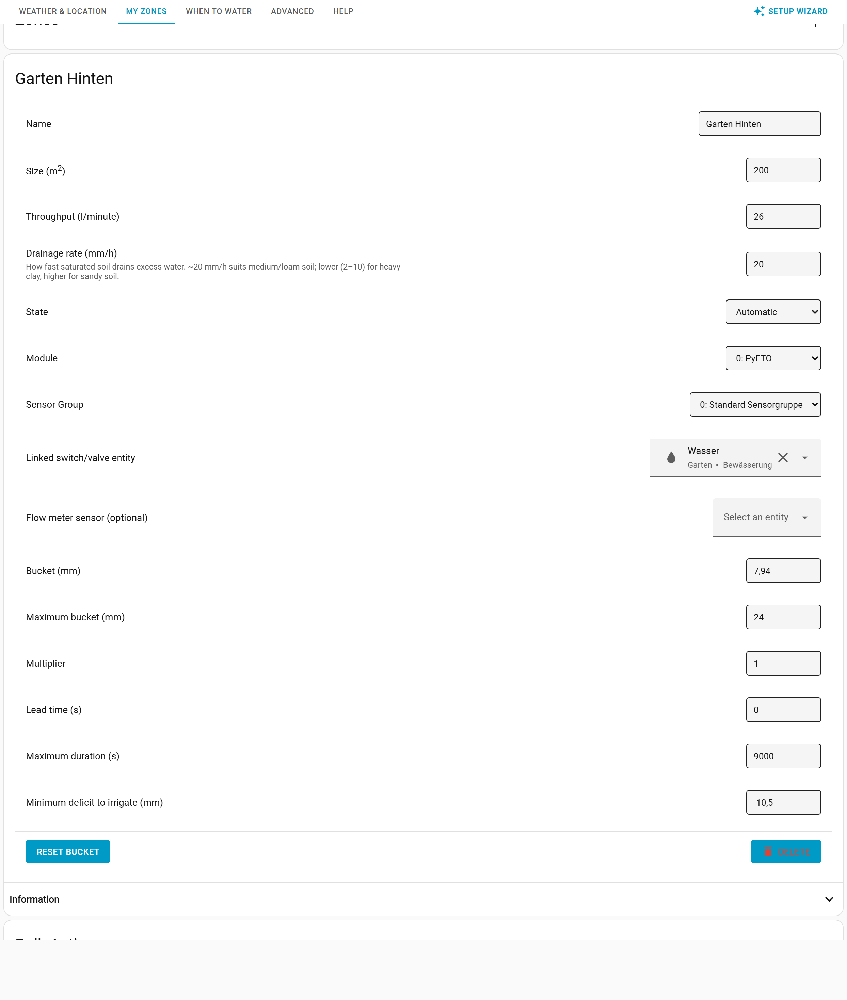

# My Zones

> Main page: [Configuration](configuration.md) 
> Previous: [Weather & Location](configuration-weather-location.md) 
> Next: [When to Water](configuration-when-to-water.md)

Specify one or more irrigation zones here. The integration calculates irrigation duration per zone, depending on size, throughput, state, [module](configuration-modules.md) and [sensor group](configuration-sensor-groups.md). A zone can be:
* **disabled**: The zone is then not calculated and duration will be set to 0.
* **automatic**: The zones duration is automatically calculated.
* **manual**: You can specify the zones duration yourself.

> When entering any values in the configuration of this integration, take notice of the labels provided so you enter values in the correct units.

## Where zones live: dashboard vs. settings

Zones appear in two places:

- The top-level **Zones** tab is the everyday **dashboard**. Each zone card shows an at-a-glance verdict (e.g. *"Watering needed: ~6 min"*, *"No watering needed"* or *"Turned off"*), a one-line status (bucket and when it was last checked), and the operational buttons **Update**, **Calculate** and **Irrigate now**. A gear icon on each card opens that zone's settings.
- **Setup → My Zones** is where you **add, configure and delete** zones, and view each zone's **calculation explanation**. (Weather records, the forecast and the watering calendar are no longer per-zone — they live once on the [**Weather & Location**](configuration-weather-location.md) tab.) The sections below ("Adding a zone", "Configuring a zone") all live here.

## Multi-zone support
For irrigation systems that have multiple zones which you want to run in series or independent you need to create multiple zones. The configuration should be done for each zone, including the area the zone covers and the corresponding settings.

## Adding a zone
Zones are added and configured under **Setup → My Zones**. Click the **+** button and provide:

- **Name**: The name of your zone, e.g. 'garden'
- **Size**: The size of this zone (m2 or sq ft)
- **Throughput**: The flow of this zone (liter/minute or gallon/minute)

After clicking **Add**, the new zone appears in the list (and as a device with entities in Home Assistant), with its settings shown directly underneath so you can finish configuring it.

## Actions on all automatic Zones
These bulk actions are split across the two surfaces:

- **Refresh weather data** / **Recalculate durations** / **Water all zones now** — on the **Zones** dashboard (top tab): collect weather data for, recalculate the duration of, or immediately irrigate every automatic zone.
- **Reset all buckets** / **Clear all weather data** — under **Setup → My Zones → Bulk Actions**: reset every automatic zone's bucket to `0`, or remove all collected weather data for the [sensor groups](configuration-sensor-groups.md) in use. Both ask for confirmation first.

## Configuring a zone
Open **Setup → My Zones**. Each zone's settings are shown directly under its name (no need to expand anything), and you can change:

- **Name**: change the name of a zone
- **Size**: change the size of a zone
- **Throughput**: change the throughput of a zone
- **Drainage rate**: set the drainage rate of a zone (mm/h or in/h). This is only applied when the bucket is above 0 (i.e. there is surplus moisture above field capacity). The full drainage rate only takes effect when the bucket is at its maximum value; below that it is applied as a fraction of the rate, following the hydraulic conductivity method of [Brooks and Corey, Eq. 4-6](https://open.library.okstate.edu/rainorshine/chapter/1-8-models-for-soil-hydraulic-conductivity/). New zones default to **20 mm/h** (a reasonable medium/loam soil value); existing zones keep whatever value they were created with. The right value depends heavily on your soil type — values quoted online (around 50.8 mm / 2 inch per hour) assume fully saturated soil and won't apply to most setups. Too low and a drainage problem isn't solved; too high and evapotranspiration has little impact. If you have drainage problems, adjust by ~5 mm/h every 24 hours until your area waters well without puddles forming.
- **Soil type**: a shortcut shown just above the drainage-rate field. Pick a soil type — *Sandy* (35 mm/h, fast draining), *Loam* (20 mm/h, balanced), *Silt* (10 mm/h, slow draining) or *Clay* (5 mm/h, very slow draining) — to fill in a typical drainage rate instead of finding it by trial and error. Choosing a type only sets the number; you can still fine-tune it afterwards (the dropdown then shows **Custom**).
- **State**:
  - _Automatic_: Automatic updating and calculation of that zone. [module](configuration-modules.md) and [sensor group](configuration-sensor-groups.md) is mandatory.
  - _Manual_: Only manual updating and calculation of that zone. No [module](configuration-modules.md) and [sensor group](configuration-sensor-groups.md) is required.
  - _Disabled_: The zone is disabled. No updating and calculation of that zone. Setting a [module](configuration-modules.md) and [sensor group](configuration-sensor-groups.md) on the zone is optional.
- **Module**: Choose the [calculation module](configuration-modules.md) that should be used to calculate irrigation for the zone.
- **Sensor group**: Choose the [sensor group](configuration-sensor-groups.md) that provides the weather data for this zone.
- **Linked switch/valve entity**: Optionally control a valve directly — see [Linked entity](#linked-entity) below.
- **Flow meter sensor** (optional): A sensor reporting the zone's actual water flow. When set, irrigation can run until the measured volume is reached instead of relying purely on the calculated time.
- **Bucket**: Either calculated or manually set. The zone needs irrigation when the bucket falls below its **minimum deficit to irrigate** (see below; default −10 mm) — a bucket of 0 or above never needs watering. See [automations](usage-automations.md) for examples on how to use this value.
- **Maximum bucket**: You can manually set a maximum bucket size which represents the soil's water holding capacity. The maximum recommended bucket size is based on the type of soil:
    - clay soil: 30 mm (1.18")
    - sandy soil: 12 mm (0.47"). 
This recommendation is based on the soil water holding capacity. See [this discussion for more details](https://github.com/jeroenterheerdt/HAsmartirrigation/discussions/448).

- **Lead time**: Time needed to warm up your irrigation system (in seconds), e.g. time to establish a connection, start a pump, build pressure, etc. After the duration is calculated, the lead time is added but only if the duration is > 0.
- **Maximum duration**: The maximum duration of the irrigation, to avoid flooding, wasting water, etc.
- **Multiplier**: Multiplies / divides the duration of the irrigation. For lawns, it is recommended to set the multiplier depending on your grass type (See [this discussion for more details](https://github.com/jeroenterheerdt/HAsmartirrigation/discussions/448)):
    * Cool-reason grasses (such as fescue, bluegrass) should be set to `0.8`
    * Warm-season grasses (such as bermuda, zoysia) should be set to `0.7`. 
- **Plant type** and **Crop coefficient (Kc)**: The weather-based evapotranspiration the integration computes is *reference* ET — the demand of a well-watered grass surface (FAO-56 ET₀). Real plantings use a fraction or multiple of that, captured by the **crop coefficient (Kc)**. Pick a **Plant type** preset to fill in a typical Kc (lawn 0.8, vegetables 1.0, flower bed 0.9, shrubs 0.5, trees 0.7, xeriscape 0.3), or choose **Custom** and enter Kc directly. Kc scales **only the ET term** of the daily balance — `delta = (Kc × ET₀) × interval + precipitation` — so rainfall is never scaled. The default `1.0` reproduces the previous reference-ET behaviour exactly.
  - **Why not a "seasonal multiplier"?** ET₀ already follows the seasons because it is computed from live weather (temperature, sun, wind). Multiplying it again by a fixed monthly factor would *double-count* that seasonality. Kc is the physically correct lever: it adjusts for *what the zone grows*, not *what time of year it is*.
  - **Kc vs Multiplier:** Kc adjusts the underlying water balance (the bucket and the live deficit), so it also affects the skip/needs-water decision. The **Multiplier** only stretches the final run *duration*. Use Kc to model the plants; reserve the Multiplier for system-level tuning. (For grass you can express the recommendation above as a `0.8`/`0.7` Kc instead of a multiplier.)
- **Minimum deficit to irrigate**: How large the moisture deficit must be before the zone is considered to need watering. It is stored as a 0-or-negative value (mm/inch); the default is `-10`, meaning the bucket must reach −10 mm before irrigation is triggered. Set it to `0` to irrigate as soon as there is any deficit, or to a more negative value to water less often but more deeply.
- **Duration**: Irrigation duration in seconds. Either calculated or manually set (manual zones only).

### Linked entity {#linked-entity}

Optionally link a Home Assistant `switch` or `valve` entity to a zone. When irrigation fires, the integration will:

1. Call `turn_on` on the entity
2. Wait for the calculated duration (in seconds)
3. Call `turn_off` on the entity

This means **no automation is needed** to control your valve — the integration does it directly. The [zone sequencing](configuration-when-to-water.md#zone-sequencing) setting on the **When to Water** tab controls whether multiple linked zones run in parallel or one after another.

> **Tip:** Start typing `switch.` or `valve.` in the field and all matching entities in your HA instance will appear as autocomplete suggestions.

If you prefer to keep using automations, simply leave this field empty and listen for the `smart_irrigation_start_irrigation_all_zones` [event](usage-events.md), which fires whenever an irrigate [schedule](configuration-schedules.md) runs.

### Available actions per zone

On the **Zones** dashboard, each zone card shows an at-a-glance verdict, a one-line status (bucket and when it was last checked), and the everyday action buttons:

* **Update** — Collect weather data from the sensor group for the zone.
* **Calculate** — Recalculate the zone's irrigation duration. The zone consumes only the weather data it needs (the shared buffer is kept for other zones and pruned automatically).
* **Irrigate Now** — Immediately turn on the zone's [linked entity](#linked-entity) for the calculated duration, then turn it off. Bypasses all skip conditions. Shown disabled with a hint until the zone has a linked entity.

The remaining per-zone tools live under **Setup → My Zones**:

* **Calculation explanation** — Expand a zone's **Information** panel for a detailed breakdown of how the bucket was updated and how the lead time and multiplier affected the final duration.
* **Delete** — Remove the zone.

> Weather records, the forecast and the 12-month seasonal outlook are no longer shown per zone — they apply to your whole location, so they now live once on the [**Weather & Location**](configuration-weather-location.md) tab.

> Main page: [Configuration](configuration.md) 
> Previous: [Weather & Location](configuration-weather-location.md) 
> Next: [When to Water](configuration-when-to-water.md)
