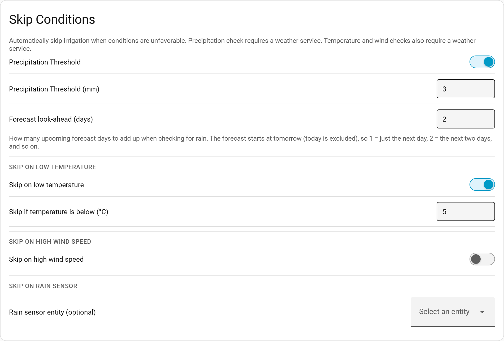

# When to Water

> Main page: [Configuration](configuration.md) 
> Previous: [My Zones](configuration-my-zones.md) 
> Next: [Schedules](configuration-schedules.md)

The **Setup → When to Water** tab holds everything that controls *when* things happen: the automatic update and calculation times, the conditions that veto a run, how often watering is allowed, how multiple zones run, and the [recurring schedules](configuration-schedules.md) that actually trigger irrigation.

The order of a typical day:

1. **Weather updates** collect data throughout the day (see below).
2. The **automatic calculation** turns the collected data into a per-zone duration (default 23:00).
3. A [**recurring schedule**](configuration-schedules.md) (e.g. *sunrise, finish before*) waters the zones — unless a [skip condition](#skip-conditions) or the [days-between limit](#days-between-irrigation-events) vetoes it.

### Automatic weather data update
If enabled, specify how often the weather-data update should happen (minutes, hours, days). You can also set an update delay to postpone the first update — useful in case your sensors do not provide a value immediately after Home Assistant starts.

As calculation needs weather data, make sure to update your weather data at least once before calculating.

### Automatic duration calculation
If enabled, set the time of calculation (HH:MM). Calculation uses the weather data collected by updates to determine the irrigation duration. During calculation each zone consumes only the readings it needs (anchored to its own watermark) — the shared weather data is **not** wiped, so other zones keep their history.

> **Note:** weather data is pruned **automatically**. Old readings are removed from the shared buffer once every zone that needs them has consumed them (with a hard cap of a few days). There is no "pruning time" to configure. You can still wipe everything manually via **Setup → My Zones → Bulk Actions → Clear all weather data**.

### Skip Conditions

These settings let you automatically skip irrigation when conditions are unfavourable. All checks are independent — any one of them can veto an irrigation event. The [dashboard's outlook banner](usage-dashboard.md#outlook-banner) shows you in advance whether the next run will likely be skipped, and why.

#### When rain is forecast
A single control decides how upcoming forecast rain affects watering. Requires a weather service to be configured.

- **Ignore it** — forecast rain is ignored; runs use the calculated duration.
- **Water less** — the upcoming forecast precipitation (summed over the look-ahead window) is subtracted from the deficit used to compute the **duration**, so the zone waters a little less. The bucket keeps the *true* deficit, so when the rain actually falls it tops the bucket up the rest of the way — the forecast rain is never double-counted once collected. If the rain misses, the next run makes up the difference.
- **Skip watering** — the run is skipped entirely when the **total** forecast precipitation across the look-ahead window exceeds the **precipitation threshold** (default 2 mm).

For *Water less* and *Skip watering* you also set the **Forecast look-ahead (days)** — how many upcoming forecast days are added together. The forecast starts at *tomorrow* (today is excluded), so `1` (the default) means just the next day, `2` the next two days, and so on.

> **Worked example (Water less).** A zone has a 10 mm deficit and 4 mm of rain is forecast within the look-ahead window. The run delivers **6 mm** and stops; the bucket is left 4 mm short, which the forecast rain is expected to fill. If the rain doesn't come, the deficit is still there and the next run waters it.

**Upgrade notes.** Before `v2026.06.13` the look-ahead window was hard-wired to two days; the default is now **1 day** (set it back to `2` for the old behaviour). The *Water less* option was previously a separate **forecast-weighted durations** toggle on the *Experimental* tab — it now lives here, backed by the same setting, so existing configurations are unchanged.

#### Skip on low temperature
If enabled, irrigation is skipped when the current temperature (from the weather service) is below the configured threshold (in °C). Useful for avoiding irrigation in near-freezing conditions.

- Default threshold: 5 °C
- Requires a weather service to be configured.

#### Skip on high wind speed
If enabled, irrigation is skipped when the current wind speed (from the weather service) is above the configured threshold (in m/s). Useful for avoiding evaporation or drift in windy conditions.

- Default threshold: 6.9 m/s (≈ 25 km/h)
- Requires a weather service to be configured.

#### Skip on frost
If enabled, irrigation is skipped when frost is expected, to protect pipes and plants from freezing. The guard compares **two** values and skips when the lower of them is below the configured threshold (default **1 °C**):

- the **current** temperature from the weather service, and
- the **forecast minimum** for the coming night (the next forecast day).

This is distinct from *Skip on low temperature*: that guard looks only at the current reading, whereas the frost guard also looks ahead so a clear, sub-freezing night is caught even when it is still mild at run time. Requires a weather service to be configured. Default **off**.

#### Rain sensor
Optionally specify a `binary_sensor` entity. If that sensor is `on` when irrigation would normally fire, the event is skipped. No weather service is required for this check — it works with any binary sensor (e.g. a physical rain detector, a virtual sensor from a weather integration).

Leave this field empty to disable the rain sensor check.

### Days between irrigation events
Configure the minimum number of days that must pass between irrigation events. This setting allows you to control how frequently irrigation can occur, which is useful for:
* **Water conservation**: Ensure adequate time between watering sessions
* **Plant health**: Allow soil to partially dry between irrigations
* **Local restrictions**: Comply with watering schedules or restrictions

**How it works:**
* **Default value**: 0 (no restriction - maintains current behavior)
* **Range**: 0-365 days
* When set to 0: Irrigation events can fire daily if conditions are met (default behavior)
* When set to a value > 0: Irrigation events will only fire if the specified number of days have passed since the last irrigation event

**Example scenarios:**
* Set to 1: Allow irrigation every other day maximum
* Set to 3: Allow irrigation only every 3 days minimum  
* Set to 7: Weekly irrigation maximum

The system automatically tracks the number of days since the last irrigation event. If an irrigation trigger occurs but insufficient days have passed, the event is skipped and the days counter continues to increment. When enough days have passed, the next trigger will fire the irrigation event and reset the counter.

This feature works alongside the skip conditions above — if several restrictions apply, all must be satisfied for irrigation to occur.

### Zone sequencing

When multiple zones have a [linked entity](configuration-my-zones.md#linked-entity) configured and irrigation fires, this setting controls whether they run at the same time or one after another.

- **Parallel** (default): all linked entities open simultaneously. Each closes after its own calculated duration.
- **Sequential**: zones run one after another. The integration waits for each zone to finish before starting the next. Zones with 0 seconds calculated duration are skipped automatically.

### Recurring schedules

Below these settings, the same tab hosts the **recurring schedules** — the daily/weekly/monthly/interval/sun-based triggers that actually start irrigation. They are covered on their own page: [Schedules](configuration-schedules.md).

### Unit System Responsiveness
Smart Irrigation automatically detects and responds to changes in your Home Assistant unit system setting (metric/imperial). When you change the unit system in Home Assistant:
* All sensor entities immediately update to display values in the new units
* The web interface refreshes to show measurements in the correct units  
* Stored configurations like precipitation thresholds maintain their values but display in appropriate units
* No restart or integration reload is required

This ensures seamless transitions between unit systems without losing your configuration data.

> Main page: [Configuration](configuration.md) 
> Previous: [My Zones](configuration-my-zones.md) 
> Next: [Schedules](configuration-schedules.md)
