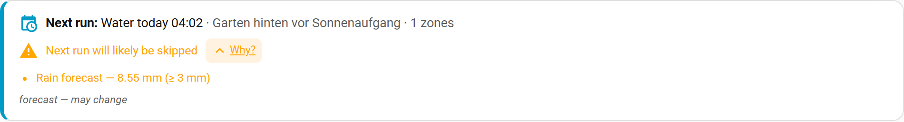
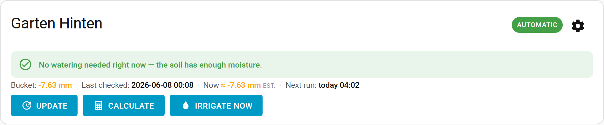

# The Zones dashboard

> Main page: [Usage](usage.md)

The **Zones** tab is the everyday dashboard. For each zone it answers the daily question — *will it water, when, and if not, why?* — and offers one-tap actions. Full configuration lives under **Setup → My Zones**; a gear icon on each card jumps there.

## Per-zone decision

Each card leads with a plain-language decision derived from the zone's state, its moisture balance and the next scheduled run:

- **Will water ~X at &lt;time&gt;** — a deficit exists and the next run will irrigate it.
- **Deficit ~X, but the next run will likely be skipped (…)** — a deficit exists, but a [skip condition](configuration-when-to-water.md#skip-conditions) will probably veto the run.
- **No watering needed** — the soil has enough moisture.
- **Deficit ~X — no schedule waters this zone; trigger manually** — there is a deficit but nothing scheduled targets the zone.
- **Turned off / Not calculated yet** — the zone is disabled, or hasn't been calculated yet.

The decision uses the same gate as the actual irrigation runner, so it will not promise watering that a skip condition would cancel.

## Outlook banner {#outlook-banner}

Above the zone cards, a banner summarises what happens next, globally:

- **Next run** — the next scheduled *irrigate* run, with its time, schedule name and target zones.
- **Skip preview** — whether that run will likely be skipped. When it will, tap **“Why?”** to expand the reasons (for example *Rain forecast — 8.6 mm ≥ 2 mm*). This is a forecast and may change before the run.
- If no schedule waters your zones, the banner says so and (in the admin panel) offers a link to set one up.

## Live estimate {#live-estimate}

The official **bucket** is recalculated once a day, at your [calculation time](configuration-when-to-water.md#automatic-duration-calculation). To give you a current picture in between, each zone also shows a small read-only **“Now ≈ −X mm (est.)”** chip next to the bucket — an estimate of how much the moisture balance has drifted **since the last calculation**.

- Where your weather service provides **hourly solar radiation** (e.g. Open-Meteo), it uses the dedicated **hourly** FAO-56 Penman-Monteith reference-ET equation — not the daily equation run more often. Hover/tap the chip to see which method was used and the “as of” time.
- Other providers fall back to an estimate based on the day's temperature range, distributed across the day by sun position.
- The estimate is **display-only**: it never changes the stored bucket or the watering decision, and it is anchored to the last calculation so it does not double-count. See [How it works](how-it-works.md#live-status-estimate).

## Actions

For automatic zones, each card offers **Update** (fetch the latest weather/sensor data), **Calculate** (recompute the watering duration), and **Irrigate now** (open the linked valve immediately — this **bypasses skip conditions**). A row at the top applies the same actions to every zone at once: **Refresh weather data**, **Recalculate durations** and **Water all zones now**.

### Run for a custom time {#run-zone}

Next to each zone's actions is a small **Run for N min** control: enter a number of minutes and press **Run** to water that zone for exactly that long. This is decoupled from the calculation — it ignores the computed duration, the deficit gate and any active rain delay — so it is handy for hand-watering a new planting or testing a valve. The water it delivers is still **credited back to the bucket**, so the next daily calculation stays honest. The same action is available as the [`run_zone`](usage-services.md) service for automations.

## Rain delay / vacation hold {#rain-delay}

Above the zone cards, a **Pause watering** control lets you stop all *automatic and scheduled* irrigation for a while — for a rainy spell, a holiday, or while you work on the system. Tap **Delay 24 h** or **Delay 48 h** for a quick hold; while a hold is active the banner shows **“Paused until …”** with a **Resume** button to lift it early.

- The hold gates only **automatic** runs (schedules and the daily decision). **Manual** actions — *Irrigate now*, *Water all zones now* and *Run for N min* — still work, so you are never locked out of watering on demand.
- A paused scheduled run is recorded in the zone's [run history](configuration-my-zones.md) as *Paused (rain delay)*, so it is clear why nothing ran.
- The same hold is exposed on the hub device as the **Pause until** `datetime` entity plus **Delay 24 h / 48 h** and **Resume** buttons (see [Entities](usage-entities.md#hub-entities)), and as the [`set_rain_delay`](usage-services.md) / `clear_rain_delay` services — so you can automate it (e.g. pause when a "vacation mode" helper turns on).

## A card for non-admin users

The panel itself is admin-only, but you can put the same everyday view on any dashboard with the shipped **[Lovelace card](usage-lovelace-card.md)** so non-admin household members can see status and water on demand.

> Main page: [Usage](usage.md)
