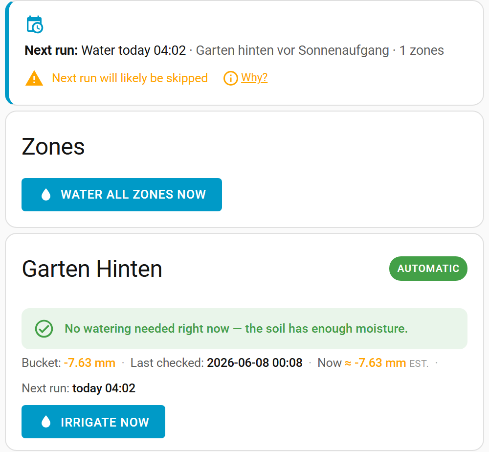

# Lovelace card (for non-admin users)

> Main page: [Usage](usage.md)

The Smart Irrigation **panel** in the sidebar is admin-only. To give non-admin household members an everyday view, the integration also ships a **Lovelace card** that mirrors the [Zones dashboard](usage-dashboard.md) — status and manual irrigation, without any access to configuration.

## Adding the card

The card is registered automatically — there is no manual resource to add. On any dashboard:

1. **Edit dashboard → Add card**, search for **“Smart Irrigation Zones”**, or
2. add it as YAML:

```yaml
type: custom:smart-irrigation-zones-card
```

> If it does not appear right after updating the integration, do a hard refresh of your browser (Ctrl/Cmd-Shift-R) to clear the cached frontend.

## What it shows

The card shows the same per-zone status as the dashboard — the [decision](usage-dashboard.md#per-zone-decision), the bucket and [live estimate](usage-dashboard.md#live-estimate), the next scheduled run, and the global [outlook banner](usage-dashboard.md#outlook-banner) — **without** the settings gear, schedule links or the setup wizard. With the default `actions: irrigate`, only the **Irrigate** buttons are shown (no Update / Calculate).



## Permissions

Any authenticated Home Assistant user can use the card. The status data and the manual **Irrigate** action are available to non-admins; **configuration stays admin-only** (it lives in the panel, which the card does not expose).

## Options

| Option | Default | Description |
| --- | --- | --- |
| `actions` | `irrigate` | Which buttons to show: `irrigate` (status + manual Irrigate only), `none` (read-only status), or `full` (also Update / Calculate, like the admin panel). |

Example — a read-only status display (e.g. for a wall tablet or a shared dashboard):

```yaml
type: custom:smart-irrigation-zones-card
actions: none
```

> Main page: [Usage](usage.md)
